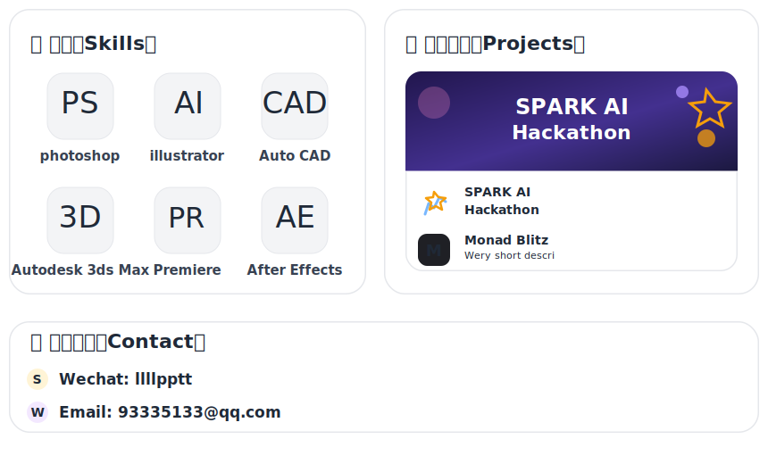

<h1 align="center">👋 Hi, I'm  Bein</h1>

  

#

  

 

🌟 `vibe coding` 领域的探索者，非计算机专业非编程行业，凭借热情开始探索世界。

•🌐 个人网站：暂不公开

•🥇 获奖比赛：[SPARK AI Hackathon](https://github.com/Minami-Bein/Kite-Drive) • [Monad Blitz](https://github.com/Minami-Bein/Utopia)

•💬 Wechat：`llllpptt`

•✉️ Email: `93335133@qq.com`

📋 我正在全力投入 `Ai` 编程的探索。我希望能开发更多有用的 `Agents` 和 `Skills` 使其同保持简单易用并成为一个独特的工具。但目前仍有许多不足。

  

 

  &nbsp;
  

## 🛠️ 技术栈

  

###

  最后更新：2026 年 4 月

